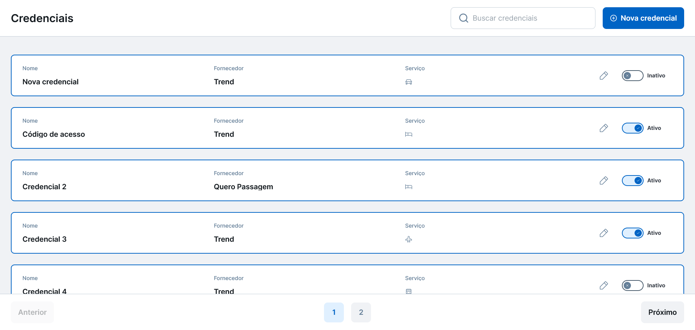

<h1 align="center"> 
	Desafio Front-End BIZTRIP
</h1>

<p align="center">
  Este projeto é parte do Desafio Front-End BIZTRIP. Ele consiste uma aplicação de gerenciamento de credenciais com funcionalidades de criação, leitura, atualização, inativação e ativação.
</p>

<p align="center">
  <a href="#-pre-requisitos">Pré-requisitos</a>&nbsp;&nbsp;&nbsp;|&nbsp;&nbsp;&nbsp;
  <a href="#-tecnologias">Tecnologias</a>&nbsp;&nbsp;&nbsp;|&nbsp;&nbsp;&nbsp;
  <a href="#-features">Features</a>&nbsp;&nbsp;&nbsp;|&nbsp;&nbsp;&nbsp;
  <a href="#-rodando-a-aplicacao">Instalação</a>
</p>

<p align="center">
    
</p>

## Pré-requisitos

Antes de começar, você vai precisar ter instalado em sua máquina as seguintes ferramentas:
[Git](https://git-scm.com), [Node.js](https://nodejs.org/en/). 
Além disto é bom ter um editor para trabalhar com o código como [VSCode](https://code.visualstudio.com/)

```bash
$ node --version
v20.10.0

$ npm --version
10.2.3
```

## Tecnologias

- [React](https://react.dev/)
- [TypeScript](https://www.typescriptlang.org/)
- [Vite](https://vitejs.dev/guide/)
- [Stitches](https://stitches.dev/docs/introduction)
- [Radix UI](https://www.radix-ui.com/primitives/docs/overview/introduction)
- [Sonner](https://sonner.emilkowal.ski/getting-started)
- [TanStack Query](https://tanstack.com/query/latest/docs/framework/react/overview)
- [React Hook Form](https://www.react-hook-form.com/get-started/)
- [Yup](https://github.com/jquense/yup)
- [Vitest](https://vitest.dev/guide/)
- [Testing Library](https://testing-library.com/docs/)
- [Storybook](https://storybook.js.org/docs/get-started)

## Features

- Cadastro de credenciais
- Listagem de credenciais com paginação
- Atualização de credenciais existentes
- Inativação de credenciais
- Ativação de credenciais
- Filtro de credenciais

## Rodando a aplicação

```bash
# Clone este repositório
$ git clone https://github.com/adrianmouzinho/biztrip-frontend

# Acesse a pasta do projeto no terminal/cmd
$ cd biztrip-frontend

# Instale as dependências
$ npm install

# Renomeie o arquivo .env.example para .env e configure a variável VITE_API_URL com o endpoint da API

# Execute a aplicação em modo de desenvolvimento
$ npm run dev

# A aplicação inciará na porta:5173 - acesse <http://localhost:5173>
```

---

Feito com ❤️ por Adrian Mouzinho